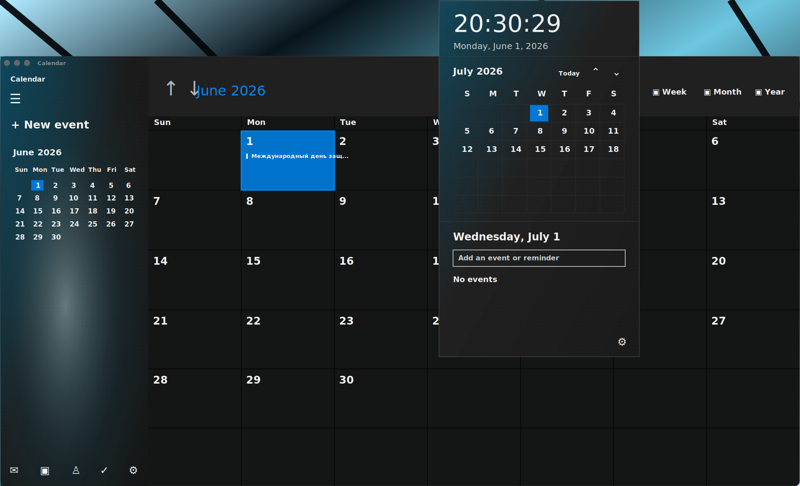
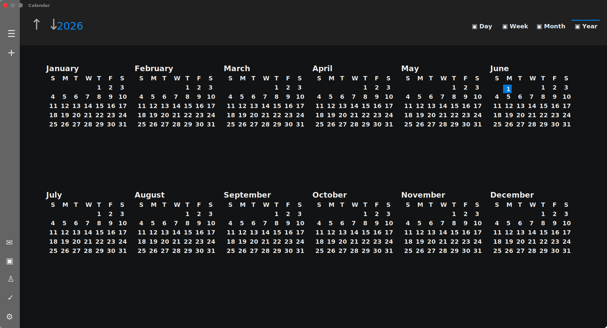
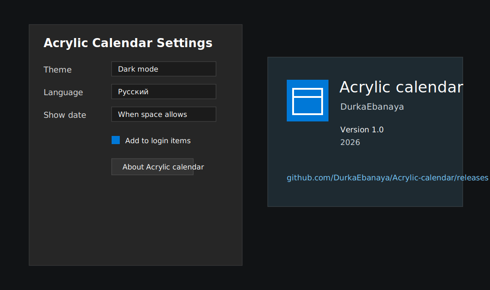

# Acrylic Calendar

Acrylic Calendar is a native macOS menu bar calendar built with Swift and AppKit. It recreates the sharper Windows 10 Fluent/Acrylic calendar style on macOS: square geometry, acrylic-like translucent surfaces, reveal highlights, dense calendar grids, and a UWP-like full calendar window.

The app is original AppKit drawing code. It does not ship Microsoft binaries, copied Microsoft assets, trademarks, or proprietary resources.



## Highlights

- Menu bar calendar flyout with month grid, agenda, quick event creation, acrylic background, and reveal hover effects.
- Full calendar window with Day, Week, Month, and Year views.
- Week view shows all seven days with events and per-day quick add entry points.
- Year view is adaptive, highlights days with events, and supports direct navigation from month/day clicks.
- EventKit integration for reading calendars and creating events with optional reminders.
- Menu bar date/time display with system, 12-hour, or 24-hour time options.
- Localized UI for English, Russian, Ukrainian, German, French, Japanese, and Tatar.
- Custom acrylic About window and generated Fluent-style calendar icon.
- Login item support controlled from Settings.
- Runs as a menu bar utility without a Dock icon.

## Screenshots





## Requirements

- macOS 13.0 or later.
- Xcode with the macOS SDK for universal builds.
- Swift 5.9 or later.

Development in this workspace was tested with Apple Swift 6.3.2 and Xcode selected at `/Applications/Xcode.app/Contents/Developer`.

## Installation

Download the latest release from:

https://github.com/DurkaEbanaya/Acrylic-calendar/releases

Unzip `Acrylic-calendar-macOS-universal.zip`, move `Acrylic calendar.app` to `/Applications`, and launch it. macOS will ask for calendar permissions when the app first needs EventKit access.

## Build

Build and package the universal `.app` plus release artifacts:

```bash
bash scripts/build_release_artifacts.sh
```

Build just the app bundle:

```bash
bash scripts/build_app.sh
```

Run from source:

```bash
swift run FluentCalendar
```

Release outputs are written to `dist/`:

- `Acrylic-calendar-macOS-universal.zip`: signed universal app bundle.
- `Acrylic-calendar-binaries.zip`: standalone command binaries for both architectures.
- `bin/FluentCalendar-x86_64`: Intel-only executable.
- `bin/FluentCalendar-arm64`: Apple Silicon-only executable.
- `bin/FluentCalendar-universal`: universal executable.
- `SHA256SUMS.txt`: checksums for release files.

## Universal Build

The universal build command is:

```bash
swift build -c release --arch x86_64 --arch arm64
```

Verify architectures:

```bash
file "dist/bin/FluentCalendar-x86_64" \
     "dist/bin/FluentCalendar-arm64" \
     "dist/bin/FluentCalendar-universal" \
     ".build/release/Acrylic calendar.app/Contents/MacOS/FluentCalendar"
```

Expected result:

- `FluentCalendar-x86_64`: `Mach-O 64-bit executable x86_64`
- `FluentCalendar-arm64`: `Mach-O 64-bit executable arm64`
- `FluentCalendar-universal`: `Mach-O universal binary with 2 architectures`
- packaged app executable: universal `x86_64 + arm64`

## Permissions

Acrylic Calendar uses EventKit. The bundle declares:

- `NSCalendarsUsageDescription`
- `NSCalendarsFullAccessUsageDescription`
- `NSCalendarsWriteOnlyAccessUsageDescription`

Calendar access is required to display events. Write access is required only when creating events from the quick add UI.

## Login Item Behavior

The Settings window has an `Add to login items` checkbox. The app does not register itself automatically on launch.

At startup, Acrylic Calendar also uses a single-instance lock so duplicate login items do not create duplicate menu bar clocks.

## Menu Bar Utility Behavior

The app is configured as a menu bar utility:

- `LSUIElement` is enabled in `Resources/Info.plist`.
- `NSApplication` uses `.accessory` activation policy.
- The app does not appear in the Dock.
- Windows are still shown and activated from the menu bar item.

## Status Item Behavior

Left-clicking the Acrylic Calendar date/time in the menu bar opens the calendar flyout through the same code path as the context menu's `Open calendar panel` command. It does not toggle the flyout closed.

Right-clicking the menu bar item opens the context menu. To avoid a first-click AppKit tracking issue seen after login/relaunch, the first left-click open request retries the flyout show once after a short delay.

## Localization

Localization is implemented in `Sources/FluentCalendar/LocalizedStrings.swift`. The app language can be set to:

- System
- English
- Русский
- Українська
- Deutsch
- Français
- 日本語
- Татарча

Date formatters use the selected app locale, so month names, weekdays, dates, and time display follow the configured language rather than always using the macOS system locale.

## Project Structure

```text
Package.swift
Resources/
  AppIcon.icns
  Info.plist
Sources/FluentCalendar/
  AboutWindowController.swift
  AcrylicBackgroundView.swift
  AppDelegate.swift
  AppSettings.swift
  CalendarPanelController.swift
  CalendarPanelView.swift
  EventKitCalendarService.swift
  FullCalendarWindowController.swift
  LocalizedStrings.swift
  QuickEventEditorView.swift
  SettingsWindowController.swift
  main.swift
scripts/
  build_app.sh
  build_release_artifacts.sh
  generate_app_icon.swift
docs/images/
  menu-flyout.svg
  settings-about.svg
  year-view.svg
```

## Main Components

- `AppDelegate`: app lifecycle, single-instance guard, menu bar item, menus, window controllers.
- `CalendarPanelController`: key-capable `NSPanel` for the menu bar flyout.
- `CalendarPanelView`: flyout drawing, mini month, agenda, quick event editor, EventKit refresh.
- `FullCalendarWindowController`: full calendar window and custom Day/Week/Month/Year rendering.
- `QuickEventEditorView`: inline flyout event creation UI.
- `EventKitCalendarService`: EventKit authorization, fetching, event creation, and Calendar.app fallback opening.
- `SettingsWindowController`: theme, localization, menu bar clock, accent, login item, and About entry.
- `AcrylicBackgroundView`: reusable acrylic-like material view.
- `AboutWindowController`: custom acrylic About window and generated app icon.
- `LocalizedStrings`: in-code localization table.

## Design Notes

The visual style intentionally follows Windows 10-era Fluent concepts rather than macOS defaults:

- Sharp rectangular layout.
- Acrylic-like translucent surfaces.
- Reveal-style hover highlights.
- Dense information layout.
- Explicit command bar and sidebar structure.

## Known Limitations

- Apple Calendar does not expose a stable public URL API for opening a specific event editor. Event clicks safely open Calendar.app instead of showing system URL errors.
- macOS does not provide a public API for hiding the built-in menu bar clock. Acrylic Calendar can open the relevant System Settings pane, but the built-in clock must be hidden manually if the OS build exposes that option.
- Release builds are ad-hoc signed by the local build scripts. Public distribution may require Developer ID signing and notarization.

## Release Checklist

```bash
swift build
bash scripts/build_release_artifacts.sh
open "dist"
```

Then upload these files to the GitHub release:

- `dist/Acrylic-calendar-macOS-universal.zip`
- `dist/Acrylic-calendar-binaries.zip`
- `dist/SHA256SUMS.txt`

## License

No explicit license has been selected yet. Until a license is added, all rights are reserved by the author.
