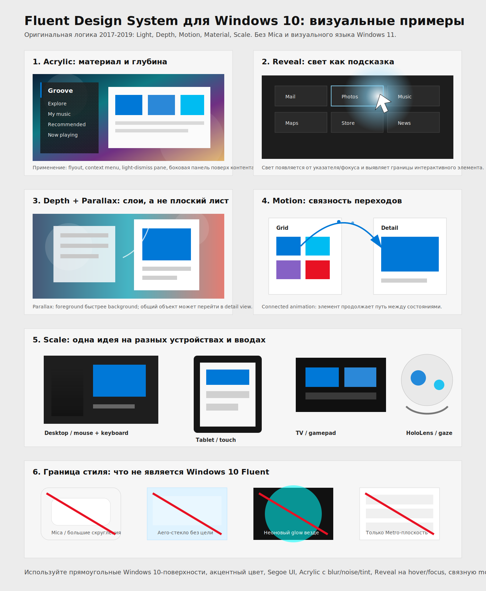

# Fluent Design System Windows 10

Понятное описание оригинального Fluent Design System, который Microsoft продвигала для Windows 10 в 2017-2019 годах. Цель документа: дать другой нейросети достаточно точное визуальное и поведенческое понимание, чтобы она могла проектировать интерфейсы в духе Windows 10 Fluent, не смешивая его с Windows 11.



## Границы исследования

Этот документ описывает Windows 10-era Fluent Design System: UWP/WinUI-подход с Acrylic, Reveal, depth, parallax, connected animations, responsive scaling и поддержкой разных устройств ввода.

Не использовать как источник стиля Windows 11: Mica, большие округлые карточки, мягкая «пухлая» геометрия, centered taskbar aesthetic, новые Fluent 2 токены, Windows 11 system backdrops. Эти идеи появились позже и меняют характер исходного Fluent.

Не путать с Aero Glass из Windows Vista/7. Acrylic похож на «материал с прозрачностью», но это не блестящее стекло. Его рецепт: фон, blur, tint, contrast/exclusion layer и тонкая noise-текстура.

## Что извлечено из двух роликов

### `Microsoft Fluent Design System` — `4Gea91T0aPI`

Ролик длится около 73 секунд. Автоматические субтитры YouTube содержат только `[Music]` и `[Laughter]`, поэтому смысл извлечён из метаданных и визуального ряда.

На экране последовательно показываются формулы вроде `Building imaginative design`, `Building eloquent design`, `Building adaptive design`, `Building coherent design`, `Building articulate design`. Затем ролик фиксирует пять основ: `Light`, `Depth`, `Motion`, `Material`, `Scale`.

Визуальный ряд показывает не набор украшений, а идею системы: интерфейс должен быть выразительным, адаптивным, связным и естественным на разных Windows-устройствах. В кадрах есть desktop-сцены, окна Windows 10, Xbox/TV-подобные сценарии, pen/touch, HoloLens/mixed reality и пространственные объекты.

### `#WindowsDevDay - Fluent Design` — `pT-zok786Yc`

Ролик длится около 64 секунд. Субтитров нет. Визуальный ряд демонстрирует Windows 10 apps с Fluent-приёмами: Calculator с подсветкой кнопок, музыкальное меню с полупрозрачной панелью, Photos/gallery, Maps, Contacts/People, Start, News, Edge/inking и большие медиагалереи.

Главные признаки из ролика: тёмные и светлые темы, акцентный синий цвет, прямоугольные поверхности Windows 10, Acrylic-панели поверх контента, Reveal-подсветка на hover/focus, галереи с глубиной, переходы между карточками и детальными экранами, поддержка pen/touch/mouse.

## Короткое определение

Fluent Design System для Windows 10 — это дизайн-система Microsoft для создания интерфейсов, которые ощущаются естественно на разных устройствах Windows: desktop, tablet, TV/Xbox, Surface Hub, HoloLens. Она строится на пяти основах: Light, Depth, Motion, Material, Scale.

Fluent не был просто «новым скином Windows». Его задача была вывести Windows UI из полностью плоской Metro-логики в систему динамических слоёв, материалов, света и движения. При этом он сохранял Windows 10-прагматизм: прямоугольные панели, плотность информации, системные команды, доступность, keyboard/mouse-first сценарии и адаптацию под touch/pen/gaze.

## Пять основ

| Основа | Смысл | Как выглядит в Windows 10 Fluent |
| --- | --- | --- |
| Light | Свет показывает фокус, интерактивность и направление внимания. | Reveal Highlight: мягкая подсветка границ и фона элемента при наведении, фокусе или gaze. |
| Depth | Интерфейс имеет z-ось, слои и контекст. | Acrylic-панели, overlay panes, parallax, elevation, переход «карточка -> деталь». |
| Motion | Движение объясняет связь между состояниями. | Connected animations, page transitions, естественные easing, короткие функциональные анимации. |
| Material | Поверхности имеют физическое качество. | Acrylic с blur, tint, opacity и noise; не чистое стекло и не Mica. |
| Scale | Один интерфейс адаптируется к устройствам, окнам и вводу. | Responsive breakpoints, NavigationView, touch targets, keyboard/mouse, pen, gamepad, gaze. |

## Light

Light в оригинальном Fluent — это не декоративное свечение. Это способ показать, что элемент живой и доступен для взаимодействия.

Reveal Highlight должен ощущаться как локальный источник света под указателем. При наведении на кнопку, пункт меню или плитку подсвечивается край, иногда мягко высвечивается фон. На тёмной теме эффект особенно заметен: свет «скользит» по границе прямоугольника и помогает понять, куда можно нажать.

Правильная реализация: слабая радиальная подсветка, короткая реакция, высокая читаемость текста, поддержка keyboard focus и hover. Неправильная реализация: постоянные неоновые ореолы, свечение всех карточек сразу, эффект ради красоты без связи с интерактивностью.

## Depth

Depth добавляет пространственную иерархию. В Metro интерфейс часто выглядел как плоская типографская плоскость. Fluent добавил ощущение слоёв: контент, navigation pane, flyout, command surface, modal/light-dismiss pane.

Acrylic помогает отделить поддерживающий слой от основного контента, не разрывая контекст. Parallax показывает, что фон дальше, чем список или карточки. Connected animation показывает, что объект из сетки является тем же объектом на детальной странице.

Глубина должна помогать пользователю понять отношения между элементами. Не нужно добавлять тени и blur везде. В Windows 10 Fluent глубина часто сдержанная: прямоугольная панель, мягкая тень, акриловая текстура, небольшой z-сдвиг при переходе.

## Motion

Motion во Fluent функционален. Анимация отвечает на вопрос: «что изменилось и почему это связано с моим действием?»

Connected animation — ключевой паттерн. Если пользователь нажал фото в галерее, это фото не должно просто исчезнуть и появиться на другой странице. Оно может визуально «продолжить» путь из плитки в заголовок detail view. Это сохраняет контекст.

Parallax — второй важный паттерн. При прокрутке foreground-список движется быстрее background-изображения. Это создаёт глубину и движение, но не должно мешать чтению.

Движение должно быть коротким, предсказуемым и отключаемым/упрощаемым для accessibility. Избегать длинных cinematic-анимаций в рабочих интерфейсах.

## Material

Главный материал Windows 10 Fluent — Acrylic. Это полупрозрачная текстура, которая создаёт глубину и визуальную связь с контентом или окружением.

Microsoft описывает Acrylic как Brush, который добавляет translucent texture. Он существует в двух логиках: background acrylic и in-app acrylic.

Background acrylic показывает wallpaper или окна за активным приложением. Он уместен для transient UI: context menus, flyouts, non-modal popups, light-dismiss panes.

In-app acrylic показывает контент внутри текущего app frame. Он уместен для navigation surfaces или панелей, которые открываются поверх содержимого и должны сохранять контекст.

Рецепт Acrylic: background, blur, exclusion/contrast layer, color tint, noise. Визуально это матовая, слегка зернистая, тонированная поверхность. Это не Aero Glass: нет глянца, отражений и «стеклянных» бликов.

Ограничения важны. Не накладывать много acrylic-панелей друг на друга. Не использовать acrylic на больших постоянных фоновых площадях. Не класть accent-colored text на acrylic, если контраст страдает. Учитывать High Contrast, Battery Saver, отключённые Transparency effects и слабое железо, где acrylic может заменяться solid color.

## Scale

Scale означает не просто responsive layout. Это способность одной системы быть естественной на разных размерах окна, расстояниях просмотра и устройствах ввода.

Для Windows apps Microsoft рекомендовала проектировать по ширине окна, а не по физическому размеру экрана. Ключевые категории: small до 640px, medium 641-1007px, large от 1008px. TV может считаться small из-за дистанции просмотра, несмотря на физически большой экран.

Scale также включает input diversity. Один интерфейс должен работать с mouse, keyboard, touch, pen, gamepad и gaze. Поэтому важны focus states, visible selection, command bars, touch targets, keyboard navigation и адаптивная плотность.

## Визуальный язык Windows 10 Fluent

| Параметр | Рекомендация |
| --- | --- |
| Геометрия | В основном прямоугольная. Скругления минимальные или отсутствуют. Не имитировать Windows 11 rounded cards. |
| Типографика | Segoe UI, ясная иерархия, крупные заголовки там, где нужен modern Windows feel. |
| Цвет | Нейтральные светлые/тёмные поверхности плюс системный accent color. Классический Windows 10 accent: `#0078D7`, также допустимы близкие синие `#2B88D8`, `#00BCF2`. |
| Иконки | Простые outline/glyph иконки в духе MDL2/Segoe MDL2 Assets. |
| Поверхности | Content canvas, NavigationView, CommandBar, flyout, menu, acrylic pane. |
| Плотность | Более рабочая и информационная, чем Windows 11. Не делать чрезмерно просторные mobile-like карточки. |
| Тени | Мягкие и функциональные. Тень обозначает слой, а не декоративную карточность. |
| Темы | Light и Dark равноправны. Reveal и Acrylic должны работать в обеих. |

## Основные паттерны

### Acrylic navigation pane

Фоновый контент или wallpaper остаётся видимым через полупрозрачную боковую панель. Панель содержит навигацию, а активный пункт отмечен accent strip или accent background. Контент под панелью может продолжаться, чтобы сохранялось ощущение потока.

Применять для compact/minimal navigation, transient panes, меню и flyouts. Для постоянной вертикальной области, которая просто делит страницу, лучше opaque background.

### Reveal list/grid items

Пункты меню, плитки, кнопки и app list items реагируют на указатель. Свет проявляет интерактивные границы. Selection и hover различимы: selection постоянен, hover временный.

### Parallax gallery

Галерея фото или магазинный hero-screen может иметь дальний фон, который движется медленнее foreground-карточек. Эффект должен быть малым. Если пользователь пришёл читать список, parallax не должен отвлекать.

### Connected card-to-detail transition

Карточка из сетки превращается в hero-объект на detail page. Это подходит для Photos, Store, News, media, documents. Смысл: сохранить идентичность объекта при навигации.

### Contextual command surface

Команды появляются рядом с выделенным объектом или в CommandBar, а не только в глобальном меню. Это особенно важно для touch/pen и productivity-сценариев. Командная поверхность должна быть плотной, ясной и keyboard-accessible.

## Практический рецепт экрана

1. Выбери Windows 10 app frame: top command area, left NavigationView, main content canvas.
2. Используй Segoe UI и системный accent color.
3. Сделай navigation pane acrylic только если она перекрывает контент или является transient. Иначе используй solid neutral panel.
4. Добавь Reveal на интерактивные пункты, кнопки и карточки.
5. Используй depth для иерархии: content ниже, pane выше, flyout ещё выше.
6. Добавь connected animation для переходов «список/сетка -> деталь».
7. Проверь scale: narrow, medium, wide; mouse, touch, keyboard focus.
8. Проверь accessibility: contrast, high contrast, reduced motion, transparency disabled.

## Prompt для другой нейросети

Используй этот текст как инструкцию генерации интерфейса:

```text
Создай интерфейс в стиле оригинального Microsoft Fluent Design System для Windows 10, эпоха 2017-2019. Не используй Windows 11, Mica, крупные скругления или Fluent 2. Основа: Light, Depth, Motion, Material, Scale.

Визуальный язык: Segoe UI, прямоугольные Windows 10-панели, light/dark theme, системный accent blue (#0078D7), плотная рабочая компоновка, NavigationView слева, CommandBar сверху или контекстно. Добавь Acrylic только для transient/flyout/navigation overlay: полупрозрачность, blur, tint, лёгкий noise, читаемый текст. Добавь Reveal Highlight на hover/focus: локальный мягкий свет от указателя, подсвечивающий край интерактивного элемента. Используй depth через слои, parallax или мягкую elevation. Motion должен объяснять связь: connected animation из карточки в detail page, короткие easing-переходы, без декоративных длинных анимаций.

Проверь адаптацию под desktop, tablet, TV/gamepad и mixed reality/gaze: видимый focus, touch targets, keyboard navigation, responsive breakpoints. Избегай Aero glass, неонового glow, бесцельного blur, чрезмерных теней и Windows 11-rounded-card эстетики.
```

## Что исключить

| Не использовать | Почему |
| --- | --- |
| Mica/SystemBackdrop как главный материал | Это Windows 11-итерация, не исходный Windows 10 Fluent. |
| Большие radius-карточки и pill buttons | Это меняет характер на Windows 11/Fluent 2. |
| Aero Glass с глянцем и отражениями | Acrylic матовый, тонированный и функциональный. |
| Постоянный neon glow | Light должен быть интерактивной подсказкой, а не украшением. |
| Blur на всём фоне | Acrylic применяется точечно, особенно для transient или overlay surfaces. |
| Слишком плоский Metro без depth/motion | Fluent был развитием Metro, а не простым возвратом к нему. |

## Источники

Использованные видео:

| Источник | Извлечённая информация |
| --- | --- |
| `https://www.youtube.com/watch?v=4Gea91T0aPI` | Визуальная декларация Fluent: imaginative, eloquent, adaptive, coherent, articulate; пять основ Light, Depth, Motion, Material, Scale; cross-device сценарии. |
| `https://youtu.be/pT-zok786Yc` | Windows Dev Day montage: Calculator, Groove/Music, Photos, Maps, Contacts, Start, Edge/inking, News; Acrylic, Reveal, galleries, responsive Windows 10 app feel. |

Документация и сетевые источники, найденные через Tavily API:

| Источник | Ключевые факты |
| --- | --- |
| [Microsoft Learn: Acrylic material](https://learn.microsoft.com/en-us/windows/uwp/design/style/acrylic) | Acrylic создаёт translucent texture, добавляет depth/hierarchy; background acrylic и in-app acrylic; применять для transient UI и overlay panes; учитывать contrast, Battery Saver, High Contrast, disabled transparency. |
| [Microsoft Learn: Parallax](https://learn.microsoft.com/en-us/windows/uwp/design/motion/parallax) | Parallax создаёт depth, perspective, movement; foreground движется быстрее background; относится к Motion, Depth и Scale. |
| [Microsoft Learn: Connected animation](https://learn.microsoft.com/en-us/windows/apps/design/motion/connected-animation) | Connected animations связывают элемент между двумя views, помогают сохранить контекст и показать отношение source/destination. |
| [Microsoft Learn: Screen sizes and breakpoints](https://learn.microsoft.com/en-us/windows/uwp/design/layout/screen-sizes-and-breakpoints-for-responsive-design) | Проектировать по ширине app window; small до 640px, medium 641-1007px, large от 1008px; учитывать TV как small из-за дистанции. |
| [Microsoft Learn: Exploring the Fluent Design System](https://learn.microsoft.com/en-us/shows/on-dotnet/exploring-the-fluent-design-system) | Fluent помогает создавать experiences, которые ощущаются естественно на устройствах от tablets/laptops до TV; важны разные interaction models. |
| [SitePoint](https://www.sitepoint.com/introducing-microsofts-fluent-design-system), [InfoWorld](https://www.infoworld.com/article/2257437/introducing-fluent-windows-10s-modern-ui-approach.html), [Windows Central](https://www.windowscentral.com/fluent-design-system) | Подтверждают ранний контекст Windows 10: развитие Metro, пять основ, Acrylic, Reveal, parallax, connected animations, постепенное внедрение в Fall Creators Update и последующие версии. |

## Итог

Оригинальный Windows 10 Fluent — это не «полупрозрачность ради красоты». Это система контекста: свет показывает интерактивность, материал создаёт поверхность, глубина объясняет иерархию, движение сохраняет связь между состояниями, scale переносит опыт между устройствами и способами ввода.

Если нужно описать стиль одной фразой: `прямоугольный, плотный, системный Windows 10 UI с Acrylic-слоями, Reveal-светом, связной motion и адаптивностью под весь спектр Windows-устройств`.
